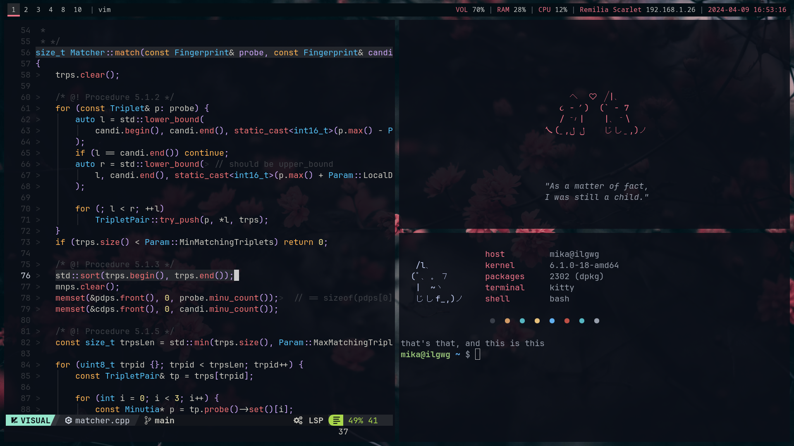
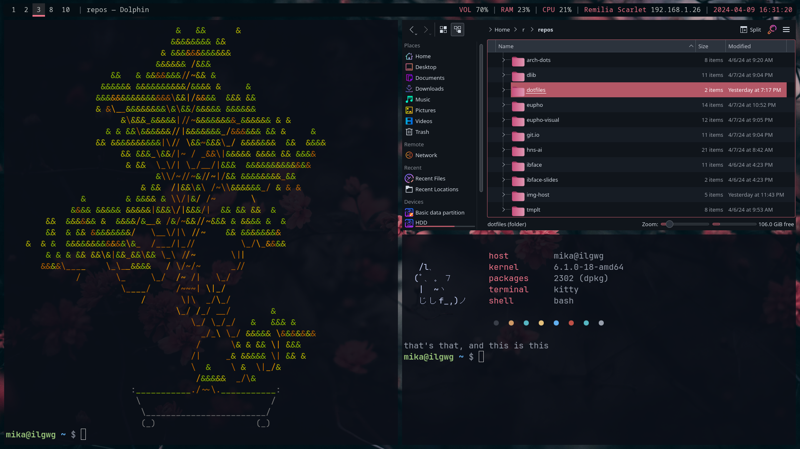
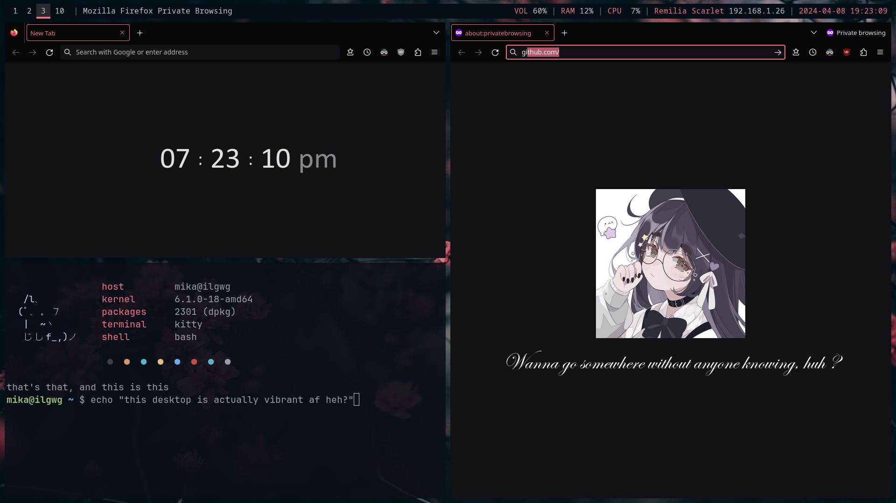

# My dotfiles

This is my very simple i3wm dotfiles, focusing on the arrangement of high-contrast colors---which I believe aren't appreciated enough. Vibrant scarlet set against a deep, cold dark-blue background... I just love it so much.

By the way, It is hard coded for dual monitors, so please edit `./profile` and `./.config/i3/config` before applying this dotfiles on other systems.

# Showcase









# Installation

Just copy everything in this repository to the home directory. Dependencies are:

```sh
sudo apt install kitty nvim i3 rofi polybar xsel compton gtk3-nocsd flameshot
```

Additional dependencies:

- [macchina](https://github.com/Macchina-CLI/macchina), whose executable file is also included here in `./.local/bin`

It should be noted that firefox extensions and KDE themes won't install on their own. For the "pinky" theme as showcased:

1. Make sure `./.local/share/*` is copied to `~/.local/share/`
2. Use KDE System Settings to load my color scheme (iluv-sakura) and my icons (iluv-icons) for GTK and KDE apps
3. Follow the guide in `./.mozilla/README.md` to theme Firefox

That should be all.

# Bonus

Previous rice: [https://github.com/iluvgirlswithglasses/arch-dots](https://github.com/iluvgirlswithglasses/arch-dots)

